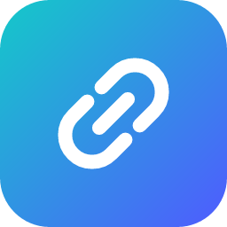

# Deeplink Launcher for Ulanzi Studio

[](https://github.com/shinoda-yosuke/ulanzi-deeplink/actions/workflows/ci.yml)

**English** · [日本語](README.ja.md)

An [Ulanzi Studio](https://www.ulanzi.com/pages/ulanzi-app) (UlanziDeck) plugin that opens any deeplink / URL scheme —
`slack://`, `obsidian://`, `zoommtg://`, `raycast://`, `https://`, … — with a single key press.
The main service is written in Node.js on top of the official [UlanziDeckPlugin-SDK](https://github.com/UlanziTechnology/UlanziDeckPlugin-SDK).



## Features

- **Open Deeplink** action: set a URL per key; pressing the key opens it with the app registered for that scheme.
- Any scheme works: app deeplinks, `https://`, `mailto:`, `x-apple.systempreferences:`, `ms-settings:`, …
- Spaces and non-ASCII characters (e.g. Japanese) are percent-encoded automatically.
- A **Test** button in the settings panel opens the link without pressing the key.
- When a link cannot be opened (no URL, no scheme, no app registered) the key shows an alert and Ulanzi Studio shows why.
- macOS and Windows. Settings panel and messages in 8 languages (en, ja, zh-CN, zh-HK, de, ko, pt, es).
- Usable inside Multi Actions.

## Install

### From a release

1. Download `com.ulanzi.deeplink.ulanziPlugin.zip` from [Releases](https://github.com/shinoda-yosuke/ulanzi-deeplink/releases).
2. Quit Ulanzi Studio and unzip it into the plugin folder, so that the folder `com.ulanzi.deeplink.ulanziPlugin` sits directly in it:
   - macOS: `~/Library/Application Support/Ulanzi/UlanziDeck/Plugins/`
   - Windows: `%APPDATA%\Ulanzi\UlanziDeck\Plugins\`
3. Start Ulanzi Studio. **Deeplink Launcher** appears in the action list.

### From source

Requires Node.js 22 or later.

```sh
npm ci
npm run plugin:install   # builds the plugin and copies it into Ulanzi Studio's plugin folder
```

Restart Ulanzi Studio afterwards if the plugin does not show up or an older version keeps running.

## Usage

1. Drag **Deeplink Launcher › Open Deeplink** onto a key.
2. Enter a URL such as `slack://open` and press **Test** to try it.
3. Press the key.

| Target | URL |
| --- | --- |
| Slack | `slack://open` |
| Zoom (join a meeting) | `zoommtg://zoom.us/join?confno=<meeting-id>` |
| Obsidian | `obsidian://open?vault=<vault name>` |
| Notion | `notion://www.notion.so/<page>` |
| Raycast | `raycast://extensions/raycast/clipboard-history/clipboard-history` |
| Spotify | `spotify:playlist:<id>` |
| VS Code | `vscode://file/<absolute path>` |
| macOS System Settings | `x-apple.systempreferences:com.apple.preference.security` |
| Windows Settings | `ms-settings:display` |
| E-mail | `mailto:someone@example.com` |
| Web page | `https://example.com` |

### How the link is opened

The main service (`plugin/app.js`) validates the URL (it must start with a scheme), percent-encodes characters that are
not allowed in URLs, and hands it to the operating system: `open` on macOS, `rundll32 url.dll,FileProtocolHandler` on
Windows. The URL is passed as a single argument without a shell, so it is never interpreted as a command line.

## Development

```sh
npm ci
npm test                  # build + unit tests + end-to-end test against a fake Ulanzi Studio
npm run plugin:link       # symlink this checkout into Ulanzi Studio (then `npm run build` after changes)
npm run plugin:install    # copy a packaged build instead
npm run plugin:uninstall
npm run package           # dist/com.ulanzi.deeplink.ulanziPlugin.zip
npm run icons             # render design/*.svg into the PNG icons
```

To run the end-to-end test with the Node.js that ships with Ulanzi Studio (Node.js 20):

```sh
PLUGIN_NODE="/Applications/Ulanzi Studio.app/Contents/MacOS/NodeJS/node" npm test
```

```text
com.ulanzi.deeplink.ulanziPlugin/  the plugin folder as installed: manifest, icons, property inspector, translations
  plugin/app.js                    bundled from src/ by `npm run build` (not committed)
  libs/                            Ulanzi SDK for the property inspector (vendored)
src/                               main service (Node.js)
  vendor/plugin-common-node/       Ulanzi SDK for Node.js (vendored)
scripts/                           build, validation, packaging, install, icon rendering
test/                              node:test suites
design/                            icon sources
```

Ulanzi Studio starts the main service as `node plugin/app.js <address> <port> <language> <version>`. For debugging,
launch Ulanzi Studio with `--log` (see "Debug in Desktop App" in the SDK README); errors from opening links are written
with the SDK's `logMessage`.

### Releasing

1. Bump `version` in `package.json` and `Version` in `com.ulanzi.deeplink.ulanziPlugin/manifest.json` (tests check they match).
2. Push a tag such as `v1.0.1`. GitHub Actions attaches the packaged zip to a new release.

## License

[MIT](LICENSE). The plugin bundles the Ulanzi SDK (Apache-2.0) and [ws](https://github.com/websockets/ws) (MIT);
see [THIRD_PARTY_NOTICES.txt](com.ulanzi.deeplink.ulanziPlugin/THIRD_PARTY_NOTICES.txt) and [src/vendor](src/vendor/README.md).

This is a community plugin and is not affiliated with Ulanzi. Its UUID (`com.ulanzi.ulanzistudio.deeplink`) follows the
naming convention required by the SDK.
